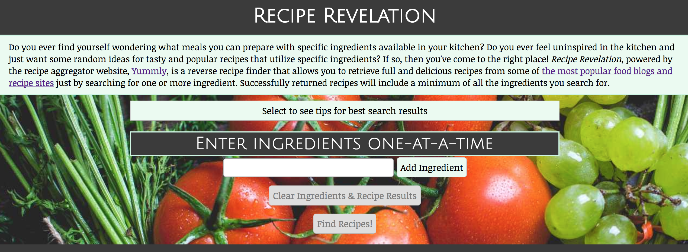
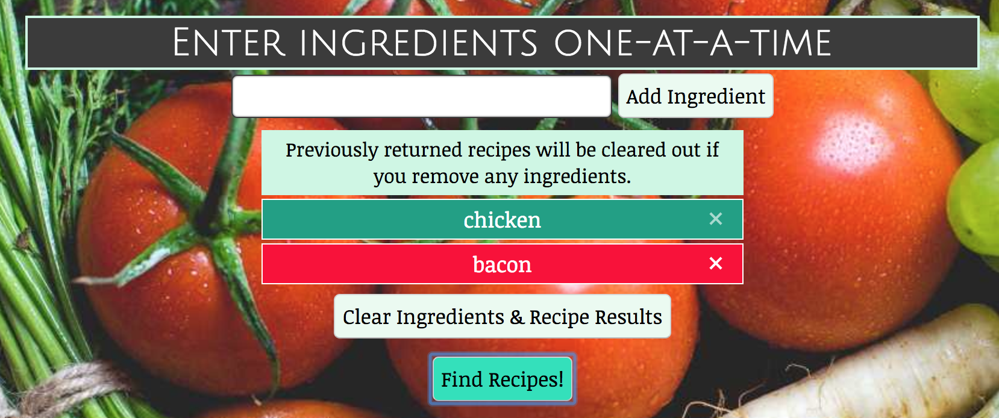
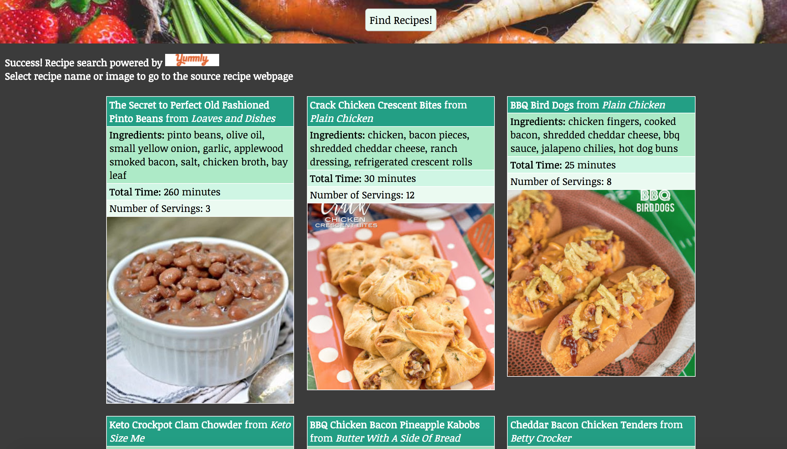
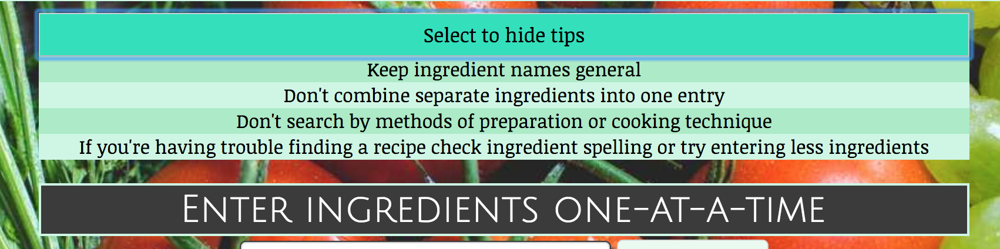
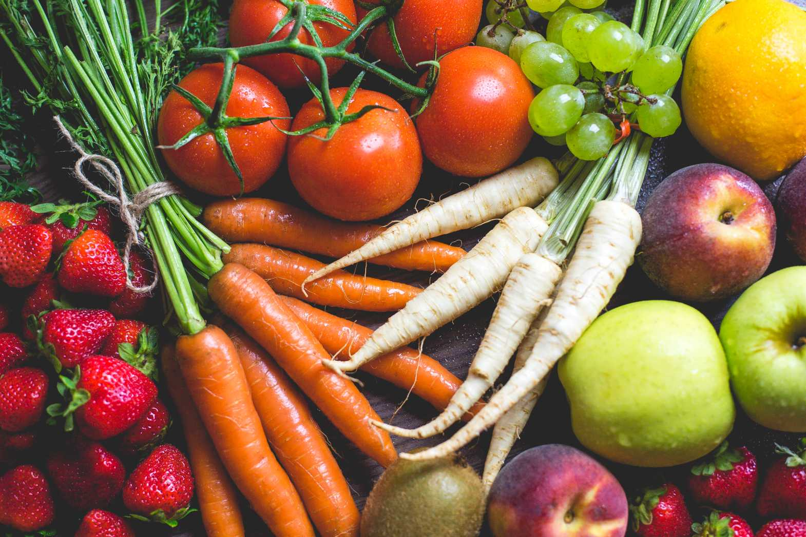

# Recipe Revelation: Thinkful API Capstone #1

# Summary of App:
This app is a 'reverse recipe finder' that utilizes yummly.com's recipe API to allow users to find popular recipes by searching for specific ingredients instead of searching by recipe name or other more traditional search methods. The app will pull recipes that at least contain all of the ingredients added to the search query. This allows you to find meals you can make with ingredients available in your kitchen and it can also give you inspiration for different recipes that you can make that you may not have been aware of. The app is powered by yummly.com's recipe aggregator API, which pulls recipe data from some of the most popular food blogs and recipe sites on the web. Returned recipes will display with recipe name, recipe source site, recipe picture, all ingredients, serving size and time. Users can select links to go to the source recipe site to view full prepartion instructions and measurements and what not.  

# Screenshots of App:

## Full Background Image

# Technology Used
- HTML
- CSS
- Javascript
- jQuery
- Responsive Design
